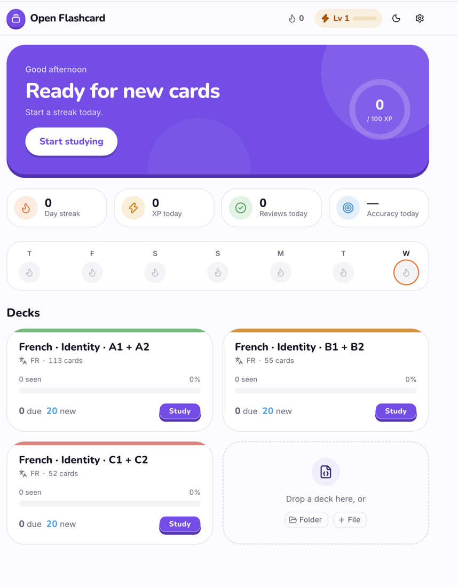
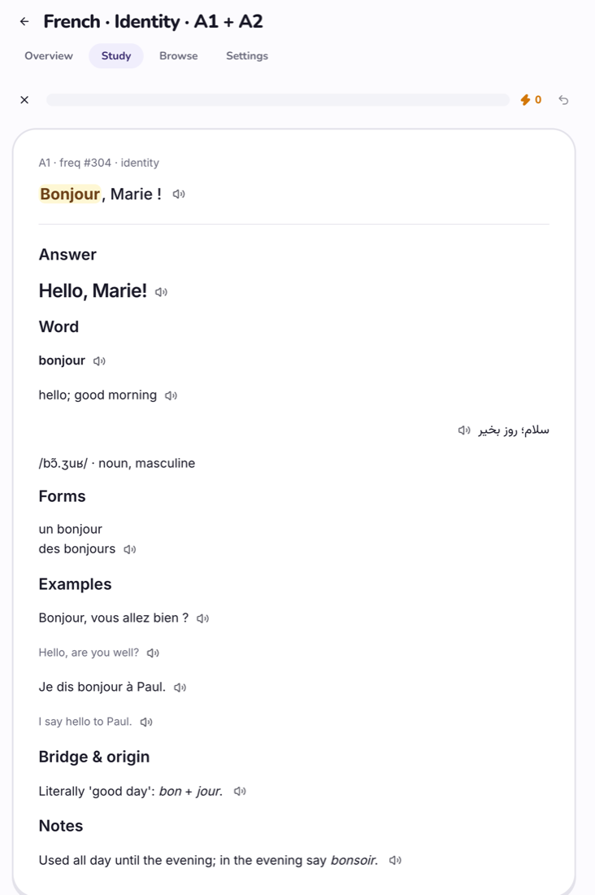
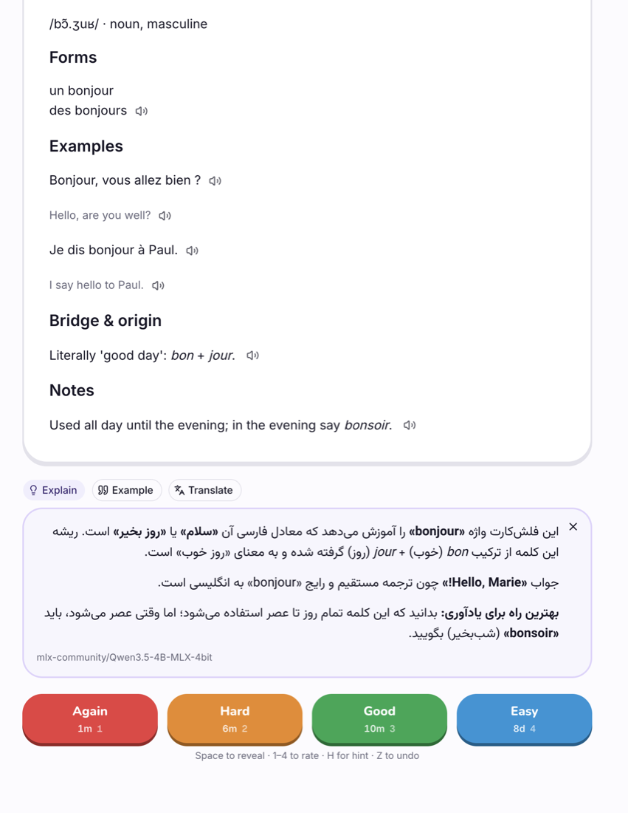
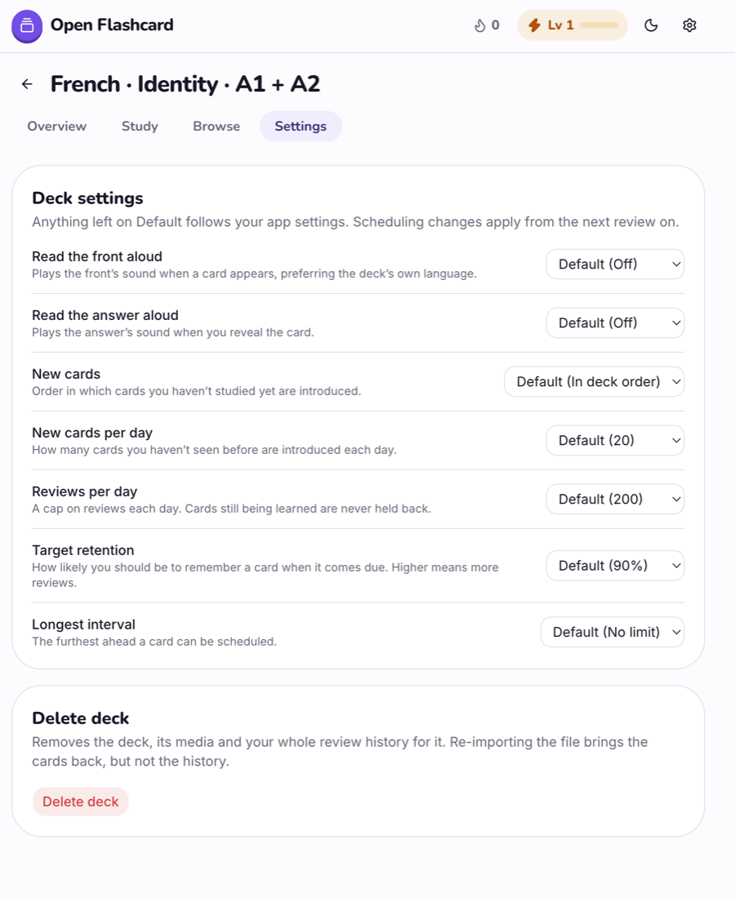

# Open Flashcard

A study app for decks in the [Open Flashcard Standard](https://github.com/open-flashcard/schema) (OFC): import a
deck, study it with FSRS spaced repetition, and keep your progress in your own browser.

It is also the reference renderer for the standard — every one of its content blocks renders as the specification
describes, so any OFC deck works, not only language decks.

<table>
  <tr>
    <td width="50%"></td>
    <td width="50%"></td>
  </tr>
  <tr>
    <td></td>
    <td></td>
  </tr>
</table>

## Features

- **Any OFC deck.** Import a `.ofc.json` file, or a deck folder with `deck.json` and its media, by picking it or
  dropping it anywhere on the page. Importing a deck again replaces it by its `id`, and cards keep their progress.
- **All fifteen content blocks** — text, Markdown, sanitized HTML, LaTeX, code, images, audio, video, embeds,
  lists, multiple choice, cloze and more — in any language and direction (`lang`, `dir`).
- **FSRS scheduling** ([ts-fsrs](https://github.com/open-spaced-repetition/ts-fsrs)): the next interval for
  each rating, a target retention and a longest interval, per deck or app-wide.
- **Daily limits** on new cards and reviews. Cards still in their learning steps are never held back.
- **Study sessions** with a progress bar, undo (`Z`), keyboard rating (`1`–`4`) and a summary at the end.
- **A game layer** — XP, levels, a daily goal and a day streak — worked out from your review history, so it can't
  drift from what you studied.
- **Read aloud.** Lines a deck marks with `speech` get a speaker button. Speech comes from a text-to-speech server
  you connect, or the browser's own voice.
- **Explain, Example and Translate** under a revealed card, answered by a language model you connect.
- **Local-first.** Decks, media, progress and settings stay in this browser (IndexedDB). There is no account and no
  backend; the only requests go to servers you configure.

## Getting started

Requires Node.js 20.9 or later.

```bash
npm install
npm run dev
```

Open [http://localhost:3000](http://localhost:3000) and drop in a deck — the
[examples](https://github.com/open-flashcard/schema/tree/main/versions/v1.0.0/examples) in the schema repository
are a good start.

## Connecting AI services (optional)

Both services are set up in **Settings → Services**, and each works with any server that speaks the standard
OpenAI API. Nothing about a particular server is built in: you give its address, and connecting asks the server
what it offers.

| Service | Used for | API it needs |
|---|---|---|
| **Text-to-speech** | Reading lines aloud | `GET /v1/models`, `POST /v1/audio/speech` |
| **Language model** | Explain, Example and Translate on cards | `GET /v1/models`, `POST /v1/chat/completions` |

When connecting, the app also reads the server's `openapi.json` if it publishes one. From it the text-to-speech
settings take the speech request's extra fields (pitch, temperature, a model's language code…) and build a form
for them, and find a voice list endpoint if the server has one — then each language your decks speak gets a voice
picked from that list.

Any OpenAI-compatible server works, such as [mlx-audio](https://github.com/Blaizzy/mlx-audio) and
[mlx-lm](https://github.com/ml-explore/mlx-lm) on a Mac, LM Studio, Ollama, vLLM, or a hosted API. Local servers
must allow requests from the app's origin (CORS).

## Scripts

| Command | |
|---|---|
| `npm run dev` | Development server |
| `npm run build` / `npm start` | Production build and server |
| `npm run typecheck` | TypeScript |
| `npm run format` | Prettier |
| `npm run lint` | ESLint |

## How it's built

[Next.js](https://nextjs.org) (App Router) and React, [Tailwind CSS](https://tailwindcss.com) with
[shadcn/ui](https://ui.shadcn.com) on Base UI, [Dexie](https://dexie.org) over IndexedDB,
[ts-fsrs](https://github.com/open-spaced-repetition/ts-fsrs) for scheduling, and the
[AI SDK](https://ai-sdk.dev) for speech and text generation.

```
app/                    routes: /, /settings, /decks/[deckId]/{study,browse,settings}
features/
  today/                the home page: today's work, streak, decks
  library/              deck cards and importing
  deck/                 the deck shell (header, tabs) and overview
  study/                study sessions: queue, rating, undo, summary
  browse/               flipping through a deck in order
  render/               the OFC renderer — one file per block type in blocks/
  assist/               Explain / Example / Translate
  settings/             study settings and the two AI services
lib/
  db/                   IndexedDB schema and deck storage
  fsrs/                 scheduling, the study queue, daily limits
  ofc/                  OFC types, loading and packages
  tts.ts, llm.ts        the AI services; openapi.ts reads what a server offers
  progress.ts           XP, levels and streaks from review history
```
